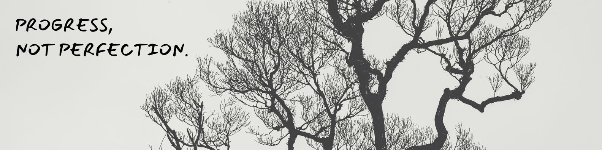

### Hi there 👋, I'm Emran Masud
#### Web Developer

Looking for a role in an organizations to leverage my web development skill my knowledge grows as the organization grows and skills with emerging web development trends.

Skills: Laravel / PHP / MySQL / REACT / JS / Ajax & jQuery / Git & Github / Linux

- 🔭 I’m currently working on <a href="https://www.omeganetbd.com/" target="_blank">Omega Net BD</a>
- 🌱 I’m currently learning Laravel & Database Design 
- 👯 I’m looking to collaborate on GitHub 
- 💬 Ask me about Web Development 
- 📫 How to reach me: emnayonpu@gmail.com 

        

  
 
  
